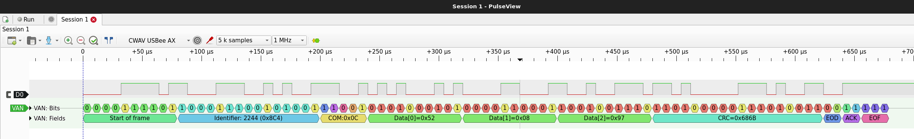

# What is it?
  It's a VAN bus decoder works with PulseView that can help you decode VAN bus protocol easily.
  
# How to use:
Install PulseView, and put the decoder files into dedicated path.
## Linux:
put __init__.py & pd.py to ~/.local/share/libsigrokdecode/decoders/van
## Windows：
put __init__.py & pd.py to %ProgramData%\libsigrokdecode\decoders\van
